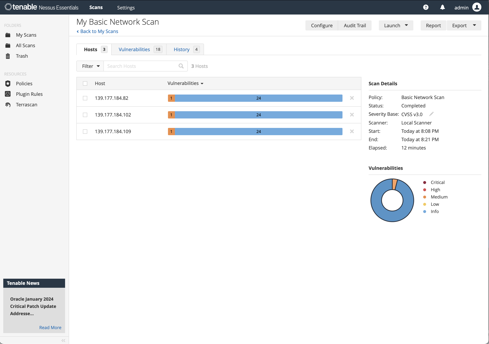

# Akamai University Compute Demo 


This repository is a demonstration highlighting how developers can leverage the core primitives of Akamai/Linode cloud platform to seamlessly deploy cloud-native applications. Offering a glimpse into a day in the life of a software developer or cloud engineer, this demo covers key aspects such as app deployment, containerization, security, networking, Linode Cloud Manager, and Infrastructure-as-Code in less than 15 minutes hands-on session.

## Features

### 1. **Cloud-Native Application Deployment:**
   - Deploy a sample cloud-native application (this demo use WordPress) showcasing Akamai Cloud Platform's core primitives
   - Showcase Kubernetes as the central tenet of cloud-native architecture to orchestrate, deploy, and auto-scale application workloads

### 2. **Developer-Friendly Workflow:**
   - Showcase a seamless developer experience from code to deployment
   - Extensive APIs for integration with popular CI/CD tools for continuous deployment
   - Intuitive graphic interface designed to enhance developers' productivity

### 3 **Security Best Practices:**
   - Implement security best practices for cloud-native applications, indifferent from any other public cloud platform
   - Showcase shared responsibility model inherent in public cloud environments

### 4 **Open Standards:**
   - Demonstrate Akamai's commitment to open standards, fostering interoperability and compatibility with other industry-leading tools and open frameworks
   - Showcase the inherent flexibility of Akamai Cloud in supporting open standards, enhancing versatility and seamless integration with diverse open-sourced technologies

## Prerequisites

- Linode account, can be created via  https://login.linode.com/signup 
- Linode Personal Access Token
- Git CLI
- Terraform CLI
- kubectl CLI

## Demo Steps

1. Clone this repository
   ```bash
   git clone https://github.com/kitan-akamai/akamai-university-demo-lke-wordpress.git
   cd akamai-university-demo-lke-wordpress
   ```

2. Execute Terraform 

   Review the Terraform script, which is to deploy a LKE cluster with three worker nodes and a Cluster Autoscaler configured to scale up to a maximum of 10 nodes. The script utilizes the Helm provider to  deploy containerized software packages (WordPress and MariaDB). In less than 30 lines, you can have a fully operational 3-tier application running on Kubernetes. Having an understanding of the APIs, you can extend the CI/CD integration from this point and seamlessly execute a full suite of DevOps tasks that are beyond the scope of this demo.

   ```bash
   export TF_VAR_linode_token="your-token-goes-here"
   terraform init
   terraform plan
   terraform apply --auto-approve
   cd ..
   unset TF_VAR_linode_token
   ```

3. Retrieve External IP that exposes the WordPress service
   ```bash
   export KUBECONFIG=./wordpress-kubeconfig.yaml
   kubectl get svc
   ```

4. Access the WordPress web application

### Change persona to Application Security

5. Create a new Kali instance using Cloud Manager UI
   
   Take the opportunity to familiarise with the functionalities of VPC, Firewall, Cloud Regions, and an intuitive Cloud Manager UI designed for enhanced productivity, offering a streamlined experience with reduced complexity for developers.

6. SSH into Kali using Terminal
   ```bash
   ssh root@[kali-ip-address]
   apt update
   ```

7. Install TightVNC, XFCE4
   ```bash
   apt install tightvncserver xfce4 -y
   ```

8. Install Zed Attack Proxy (or any other web application security testing tool such as Burpsuite or Nikto)
   ```bash
   apt install zaproxy -y
   ```

9. Start VNC Server to create initial configuration
   ```bash
   tightvncserver
   ```

10. Modify VNC Server configuration
    ```bash
    tightvncserver -kill :1
    nano ~/.vnc/xstartup
    ```

11. Add XFCE as desktop environment
    ```bash
    #!/bin/sh
    xrdb $HOME/.Xresources
    startxfce4 &
    ```

12. Start VNC server 
    ```bash
    tightvncserver
    ```

13. Create an SSH tunnel in a new terminal and connect to Kali via VNC
    ```bash
    ssh -L 61000:localhost:5901 -l root@[kali-ip-address]
    ```
    Use your favourite VNC viewer or Finder.

14. Open terminal in Kali, start zaproxy

    

15. Launch an automated scan attack against the WordPress application

    

    The strength of the open standards in facilitating web application development and the versatility of the Akamai Cloud Platform makes it well-suited for a wide range of software development requirements. Securing applications on Akamai Cloud is no different than in any other public cloud platform.

### Change persona to Network/System Security Engineer

16. Create a new Ubuntu instance using Cloud Manager UI

    Take the opportunity to familiarise with the functionalities of VPC, Firewall, Cloud Regions, and an intuitive Cloud Manager UI designed for enhanced productivity, offering a streamlined experience with reduced complexity for developers.

17. SSH into Ubuntu using Terminal
    ```bash
    ssh root@[kali-ip-address]
    apt update
    ```

18. Download Nessus package (or any other vulnerability scanning tool such as OpenVAS or Nexpose)
    ```bash
    curl --request GET \
    --url 'https://www.tenable.com/downloads/api/v2/pages/nessus/files/Nessus-10.6.4-ubuntu1404_amd64.deb' \
    --output 'Nessus-10.6.4-ubuntu1404_amd64.deb'
    ```

19. Install Nessus
    ```bash
    dpkg -i Nessus-10.6.4-ubuntu1404_amd64.deb
    ```
20. Start Nessus
    ```bash
    systemctl start nessusd
    ```

21. Access Nessus UI at [your-nessus-ip:8834]

    Follow the on-screen configurations, user are required to register to use Nessus Essentials. Allow a few minutes for the download and compilation of the latest plugins before initiating a new scan.

22. Initiate a Network Scan against LKE worker nodes
   
    

23. Investigate Nessus scan result

    At the time of writing, Terrapin (CVE-2023-48795, identified on 18 December 2023) affecting SSH is detected as a medium-severity vulnerability. This is a common type of vulnerability across all public cloud platforms. Mitigation patches are available for addressing the vulnerability. However, as we leverage Kubernetes as the orchestration engine, access to worker nodes is not necessary. Turn off SSH by applying a daemonset via kubectl:

    ```bash
    kubectl apply -f ./disable-ssh.yml
    ```
   
    Due to the Shared Responsibility Model in the Cloud, securing systems on Akamai Cloud is no different than in any other public cloud platform.

## Disclaimer
The deployment provided in this repository is minimal and intended for demonstration purposes only.